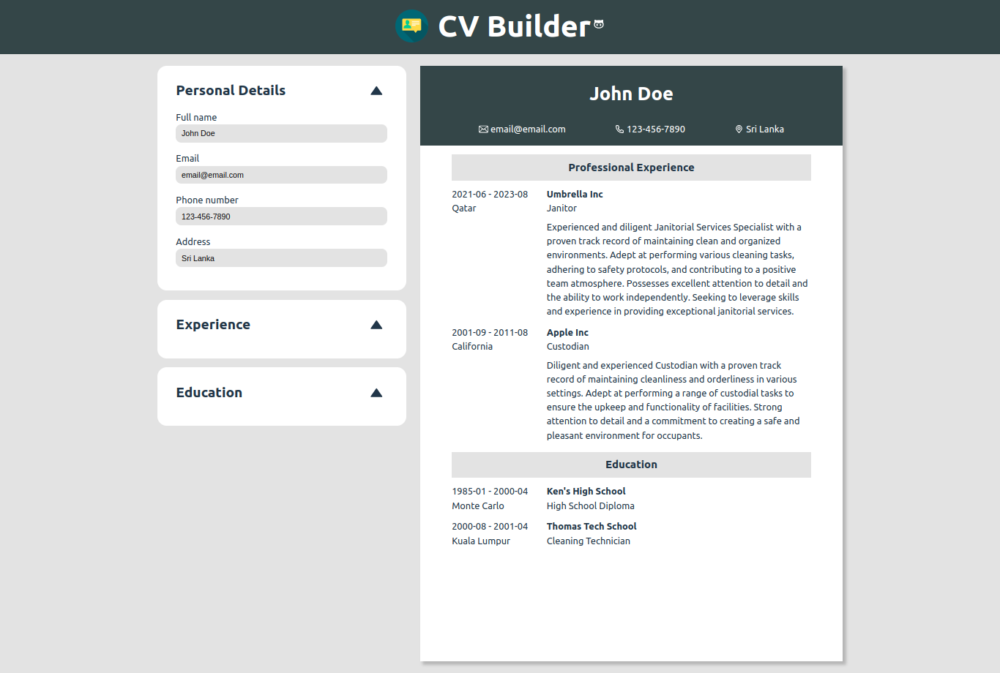

# React CV Builder App

### Live Preview
https://main--genuine-kitten-bed531.netlify.app/

### Overview
The React CV Builder App is a powerful and user-friendly web application that allows you to create and customize your professional Curriculum Vitae (CV) with ease. Craft a standout CV to showcase your skills, experience, and qualifications in a visually appealing way.

### Key Features
* **User-Friendly Interface**: Create your CV effortlessly with an intuitive and easy-to-navigate interface.
* **Customization**: Tailor your CV by adding personal information, contact details, work experience and education.
* **Real-Time Preview**: See how your CV looks in real-time as you make edits and customizations.
* **Responsive Design**: The app is responsive, ensuring your CV looks great on both desktop and mobile devices.
